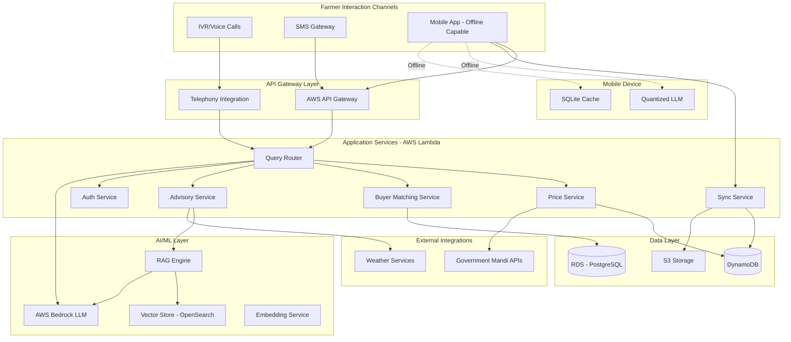

# AgriBridge AI – System Design Document

**Track:** AI for Rural Innovation & Sustainable Systems  
**Program:** AI for Bharat Hackathon  
**Version:** 1.0  
**Prepared by:** Team CodeAshRam
**Date:** February 2026

## Executive Summary

AgriBridge AI is an offline-first agricultural intelligence platform designed to empower farmers in low-connectivity regions with real-time market price visibility, crop advisory, and direct buyer matching through voice, SMS, and mobile channels. The system uses a hybrid edge–cloud architecture leveraging AWS serverless infrastructure, foundation models, and on-device quantized AI models to ensure accessibility, scalability, and resilience. This design enables farmers to make data-driven selling and cultivation decisions while reducing dependence on intermediaries.


## Overview

AgriBridge AI is an offline-first, multi-channel agricultural intelligence platform that enables farmers to access market prices, crop advisory, and buyer connections through voice (IVR), SMS, and mobile applications. The system uses a hybrid cloud-edge architecture where AWS cloud services provide AI intelligence and data synchronization, while quantized on-device models enable offline functionality.

The platform leverages AWS Bedrock for conversational AI, implements Retrieval Augmented Generation (RAG) for knowledge-grounded responses, and uses vector search for semantic matching. The mobile application uses quantized small language models for offline inference, syncing with cloud services when connectivity is available.

## Architecture

### High-Level Architecture



### Deployment Architecture

The platform uses a serverless architecture on AWS with the following components:

1. **API Gateway**: REST and WebSocket APIs for mobile app and SMS gateway integration
2. **Lambda Functions**: Serverless compute for all business logic
3. **DynamoDB**: NoSQL database for farmer profiles, price data, and query logs
4. **RDS PostgreSQL**: Relational database for buyer-farmer matching and transactions
5. **OpenSearch**: Vector database for RAG implementation
6. **S3**: Storage for advisory documents, crop images, and model artifacts
7. **Bedrock**: Managed LLM service (Claude or Llama models)
8. **CloudWatch**: Logging, monitoring, and alerting
9. **Cognito**: User authentication and authorization (optional, can use custom auth)

### Offline-First Mobile Architecture

The mobile application implements a local-first architecture:

1. **Quantized Model**: 4-bit or 8-bit quantized LLM (e.g., Llama 2 7B quantized to ~500MB)
2. **SQLite Database**: Local cache for prices, advisory content, and user data
3. **Sync Engine**: Background service for bidirectional data synchronization
4. **Conflict Resolution**: Last-write-wins with timestamp-based merging

### Small Model Optimization Layer

To improve the performance of compact on-device language models, the system integrates **Hugging Face Upskill-based optimization techniques**. These techniques enhance inference efficiency and response quality of quantized models deployed on edge devices such as smartphones and laptops.

Optimized models are periodically generated in the cloud training pipeline and distributed to mobile devices during WiFi-based updates. This ensures that farmers receive improved offline advisory performance while maintaining low memory and compute requirements suitable for low-end devices.


## Components and Interfaces

### 1. Query Router Service

**Responsibility**: Routes incoming queries to appropriate services based on intent classification.

**Interface**:
```typescript
interface QueryRouterService {
  routeQuery(request: QueryRequest): Promise<QueryResponse>
  classifyIntent(query: string, language: string): Promise<Intent>
}

interface QueryRequest {
  userId: string
  query: string
  channel: 'IVR' | 'SMS' | 'MOBILE'
  language: string
  sessionId?: string
  location?: GeoLocation
}

interface QueryResponse {
  response: string
  intent: Intent
  confidence: number
  metadata: ResponseMetadata
}

enum Intent {
  PRICE_QUERY,
  BUYER_MATCHING,
  CROP_ADVISORY,
  FERTILIZER_ADVICE,
  WEATHER_INFO,
  GENERAL_QUERY
}
```

**Implementation Notes**:
- Uses AWS Bedrock for intent classification
- Maintains conversation context in DynamoDB with TTL
- Routes to specialized services based on intent
- Handles multi-turn conversations

### 2. Price Service

**Responsibility**: Fetches, caches, and serves mandi price information with trend analysis.

**Interface**:
```typescript
interface PriceService {
  getCurrentPrices(crop: string, location: GeoLocation): Promise<PriceData[]>
  getPriceTrends(crop: string, location: GeoLocation, days: number): Promise<TrendData>
  getSellingRecommendation(crop: string, quantity: number, location: GeoLocation): Promise<Recommendation>
}

interface PriceData {
  mandiName: string
  mandiLocation: GeoLocation
  cropName: string
  variety: string
  pricePerQuintal: number
  currency: 'INR'
  timestamp: Date
  source: string
}

interface TrendData {
  crop: string
  historicalPrices: TimeSeriesPoint[]
  forecast: TimeSeriesPoint[]
  seasonalPattern: string
  volatility: number
}

interface Recommendation {
  action: 'SELL_NOW' | 'WAIT' | 'SELL_WITHIN_WEEK'
  confidence: number
  reasoning: string
  expectedPriceRange: { min: number, max: number }
  optimalTiming: Date
}
```

**Implementation Notes**:
- Integrates with government mandi APIs (e.g., Agmarknet)
- Caches prices in DynamoDB with 24-hour TTL
- Uses time-series analysis for trend forecasting
- Implements exponential smoothing for price predictions

### 3. Buyer Matching Service

**Responsibility**: Matches farmers with buyers based on crop availability, location, and requirements.

**Interface**:
```typescript
interface BuyerMatchingService {
  registerCropAvailability(farmerId: string, crop: CropAvailability): Promise<string>
  findBuyers(farmerId: string, cropId: string): Promise<BuyerMatch[]>
  findFarmers(buyerId: string, requirements: CropRequirements): Promise<FarmerMatch[]>
  recordTransaction(transaction: Transaction): Promise<void>
  getRatings(userId: string, userType: 'FARMER' | 'BUYER'): Promise<Rating>
}

interface CropAvailability {
  cropType: string
  variety: string
  quantity: number
  unit: 'QUINTAL' | 'TON'
  qualityGrade: 'A' | 'B' | 'C'
  harvestDate: Date
  location: GeoLocation
  priceExpectation?: number
  images?: string[]
}

interface BuyerMatch {
  buyerId: string
  buyerName: string
  businessName: string
  location: GeoLocation
  distance: number
  typicalVolume: number
  rating: number
  contactAllowed: boolean
  phoneNumber?: string
}

interface CropRequirements {
  cropTypes: string[]
  minQuantity: number
  maxDistance: number
  qualityGrades: string[]
  maxPrice?: number
}
```

**Implementation Notes**:
- Uses PostgreSQL with PostGIS extension for geospatial queries
- Implements radius-based matching with configurable distance
- Requires farmer consent before sharing contact information
- Maintains transaction history for rating calculations

### 4. Advisory Service

**Responsibility**: Provides crop and fertilizer advisory using RAG-enhanced LLM responses.

**Interface**:
```typescript
interface AdvisoryService {
  getCropAdvisory(crop: string, stage: string, location: GeoLocation): Promise<Advisory>
  getFertilizerRecommendation(crop: string, soilType: string, season: string): Promise<FertilizerAdvice>
  getWeatherBasedAdvice(location: GeoLocation): Promise<WeatherAdvice>
}

interface Advisory {
  content: string
  language: string
  sources: string[]
  confidence: number
  lastUpdated: Date
  applicableRegions: string[]
}

interface FertilizerAdvice {
  recommendations: FertilizerRecommendation[]
  timing: string
  dosage: string
  precautions: string[]
  alternatives: string[]
}

interface FertilizerRecommendation {
  name: string
  type: 'ORGANIC' | 'CHEMICAL' | 'BIO'
  npkRatio: string
  applicationMethod: string
  estimatedCost: number
}
```

**Implementation Notes**:
- Implements RAG using OpenSearch vector store
- Stores agricultural documents as embeddings
- Uses AWS Bedrock for response generation
- Integrates weather data for context-aware advice

### 5. RAG Engine

**Responsibility**: Retrieves relevant agricultural knowledge to augment LLM responses.

**Interface**:
```typescript
interface RAGEngine {
  retrieveContext(query: string, topK: number): Promise<Document[]>
  generateEmbedding(text: string): Promise<number[]>
  augmentQuery(query: string, context: Document[]): Promise<string>
  updateKnowledgeBase(documents: Document[]): Promise<void>
}

interface Document {
  id: string
  content: string
  metadata: DocumentMetadata
  embedding: number[]
  relevanceScore: number
}

interface DocumentMetadata {
  source: string
  language: string
  cropTypes: string[]
  region: string
  lastUpdated: Date
  verified: boolean
}
```

**Implementation Notes**:
- Uses OpenSearch k-NN for vector similarity search
- Generates embeddings using AWS Bedrock Titan Embeddings
- Retrieves top 5 documents by default
- Implements semantic caching to reduce embedding calls

### 6. Sync Service

**Responsibility**: Synchronizes data between mobile devices and cloud when connectivity is available.

**Interface**:
```typescript
interface SyncService {
  syncUp(deviceId: string, localChanges: SyncPayload): Promise<SyncResult>
  syncDown(deviceId: string, lastSyncTimestamp: Date): Promise<SyncPayload>
  resolveConflicts(conflicts: Conflict[]): Promise<Resolution[]>
}

interface SyncPayload {
  queries: OfflineQuery[]
  cropAvailability: CropAvailability[]
  profileUpdates: ProfileUpdate[]
  timestamp: Date
}

interface SyncResult {
  success: boolean
  syncedItems: number
  conflicts: Conflict[]
  newData: SyncPayload
}

interface Conflict {
  entityType: string
  entityId: string
  localVersion: any
  serverVersion: any
  timestamp: Date
}
```

**Implementation Notes**:
- Uses delta synchronization to minimize data transfer
- Implements last-write-wins conflict resolution
- Prioritizes critical data (prices, buyer matches)
- Uses exponential backoff for retry logic

### 7. IVR Integration Service

**Responsibility**: Handles telephony integration for voice-based farmer interaction.

**Interface**:
```typescript
interface IVRService {
  handleIncomingCall(callId: string, phoneNumber: string): Promise<IVRSession>
  processVoiceInput(sessionId: string, audioData: Buffer): Promise<string>
  convertTextToSpeech(text: string, language: string): Promise<Buffer>
  handleDTMFInput(sessionId: string, digits: string): Promise<IVRResponse>
}

interface IVRSession {
  sessionId: string
  phoneNumber: string
  language: string
  state: IVRState
  conversationHistory: ConversationTurn[]
}

enum IVRState {
  LANGUAGE_SELECTION,
  MAIN_MENU,
  PRICE_QUERY,
  BUYER_MATCHING,
  ADVISORY,
  COMPLETED
}

interface IVRResponse {
  audioResponse: Buffer
  nextState: IVRState
  menuOptions?: string[]
}
```

**Implementation Notes**:
- Integrates with telephony providers (Twilio, Exotel, or Kaleyra)
- Uses AWS Transcribe for speech-to-text
- Uses AWS Polly for text-to-speech in regional languages
- Supports both DTMF and voice input
- Records calls with consent for quality assurance

### 8. SMS Gateway Service

**Responsibility**: Processes SMS queries and sends responses.

**Interface**:
```typescript
interface SMSService {
  receiveMessage(from: string, message: string): Promise<void>
  sendMessage(to: string, message: string): Promise<SendResult>
  parseStructuredCommand(message: string): Promise<SMSCommand>
  formatResponse(data: any, maxLength: number): string[]
}

interface SMSCommand {
  command: 'PRICE' | 'BUYER' | 'ADVISORY' | 'HELP'
  parameters: Map<string, string>
  isStructured: boolean
}

interface SendResult {
  messageId: string
  status: 'SENT' | 'FAILED' | 'QUEUED'
  segments: number
}
```

**Implementation Notes**:
- Integrates with SMS gateway providers (AWS SNS, Twilio)
- Supports both structured commands and natural language
- Splits long responses into multiple SMS segments
- Implements rate limiting (10 queries per farmer per day)

### 9. Authentication Service

**Responsibility**: Manages user authentication and authorization.

**Interface**:
```typescript
interface AuthService {
  sendOTP(phoneNumber: string): Promise<string>
  verifyOTP(phoneNumber: string, otp: string): Promise<AuthToken>
  validateToken(token: string): Promise<UserContext>
  createProfile(phoneNumber: string, profile: UserProfile): Promise<string>
}

interface AuthToken {
  token: string
  expiresAt: Date
  userId: string
  userType: 'FARMER' | 'BUYER' | 'ADMIN'
}

interface UserProfile {
  name: string
  phoneNumber: string
  language: string
  location: GeoLocation
  userType: 'FARMER' | 'BUYER'
  farmerProfile?: FarmerProfile
  buyerProfile?: BuyerProfile
}

interface FarmerProfile {
  landSize: number
  cropTypes: string[]
  soilType: string
  district: string
}
```

**Implementation Notes**:
- Uses phone number as unique identifier
- Implements OTP-based passwordless authentication
- Stores hashed phone numbers for privacy
- Uses JWT tokens for session management

## Data Models

### DynamoDB Tables

#### 1. Farmers Table
```typescript
interface FarmerRecord {
  PK: string              // "FARMER#{phoneHash}"
  SK: string              // "PROFILE"
  userId: string
  phoneNumber: string     // Encrypted
  name: string
  language: string
  location: GeoLocation
  landSize: number
  cropTypes: string[]
  soilType: string
  district: string
  createdAt: Date
  lastActive: Date
  GSI1PK: string         // "DISTRICT#{district}"
  GSI1SK: string         // "FARMER#{userId}"
}
```

#### 2. Price Cache Table
```typescript
interface PriceCacheRecord {
  PK: string              // "PRICE#{crop}#{district}"
  SK: string              // "DATE#{YYYY-MM-DD}"
  crop: string
  variety: string
  mandiName: string
  location: GeoLocation
  pricePerQuintal: number
  timestamp: Date
  source: string
  TTL: number            // 24 hours
}
```

#### 3. Query Log Table
```typescript
interface QueryLogRecord {
  PK: string              // "USER#{userId}"
  SK: string              // "QUERY#{timestamp}"
  queryId: string
  query: string
  intent: Intent
  channel: string
  language: string
  response: string
  responseTime: number
  timestamp: Date
  sessionId?: string
}
```

#### 4. Conversation Context Table
```typescript
interface ConversationRecord {
  PK: string              // "SESSION#{sessionId}"
  SK: string              // "TURN#{turnNumber}"
  sessionId: string
  userId: string
  userMessage: string
  assistantMessage: string
  intent: Intent
  timestamp: Date
  TTL: number            // 1 hour
}
```

### RDS PostgreSQL Schema

#### 1. Buyers Table
```sql
CREATE TABLE buyers (
  buyer_id UUID PRIMARY KEY,
  phone_number VARCHAR(20) UNIQUE NOT NULL,
  business_name VARCHAR(255) NOT NULL,
  contact_person VARCHAR(255),
  location GEOGRAPHY(POINT, 4326),
  district VARCHAR(100),
  state VARCHAR(100),
  crop_interests TEXT[],
  typical_volume_quintal INTEGER,
  max_purchase_distance_km INTEGER,
  quality_preferences TEXT[],
  rating DECIMAL(3,2),
  verified BOOLEAN DEFAULT FALSE,
  created_at TIMESTAMP DEFAULT NOW(),
  last_active TIMESTAMP
);

CREATE INDEX idx_buyers_location ON buyers USING GIST(location);
CREATE INDEX idx_buyers_district ON buyers(district);
```

#### 2. Crop Availability Table
```sql
CREATE TABLE crop_availability (
  availability_id UUID PRIMARY KEY,
  farmer_id VARCHAR(100) NOT NULL,
  crop_type VARCHAR(100) NOT NULL,
  variety VARCHAR(100),
  quantity_quintal DECIMAL(10,2) NOT NULL,
  quality_grade VARCHAR(10),
  harvest_date DATE,
  location GEOGRAPHY(POINT, 4326),
  district VARCHAR(100),
  price_expectation DECIMAL(10,2),
  status VARCHAR(20) DEFAULT 'AVAILABLE',
  created_at TIMESTAMP DEFAULT NOW(),
  updated_at TIMESTAMP DEFAULT NOW()
);

CREATE INDEX idx_crop_location ON crop_availability USING GIST(location);
CREATE INDEX idx_crop_type ON crop_availability(crop_type);
CREATE INDEX idx_crop_status ON crop_availability(status);
```

#### 3. Matches Table
```sql
CREATE TABLE matches (
  match_id UUID PRIMARY KEY,
  farmer_id VARCHAR(100) NOT NULL,
  buyer_id UUID NOT NULL,
  availability_id UUID NOT NULL,
  match_score DECIMAL(5,2),
  distance_km DECIMAL(10,2),
  farmer_consent BOOLEAN DEFAULT FALSE,
  buyer_viewed BOOLEAN DEFAULT FALSE,
  status VARCHAR(20) DEFAULT 'PENDING',
  created_at TIMESTAMP DEFAULT NOW(),
  FOREIGN KEY (buyer_id) REFERENCES buyers(buyer_id),
  FOREIGN KEY (availability_id) REFERENCES crop_availability(availability_id)
);

CREATE INDEX idx_matches_farmer ON matches(farmer_id);
CREATE INDEX idx_matches_buyer ON matches(buyer_id);
```

#### 4. Transactions Table
```sql
CREATE TABLE transactions (
  transaction_id UUID PRIMARY KEY,
  match_id UUID NOT NULL,
  farmer_id VARCHAR(100) NOT NULL,
  buyer_id UUID NOT NULL,
  crop_type VARCHAR(100),
  quantity_quintal DECIMAL(10,2),
  price_per_quintal DECIMAL(10,2),
  total_amount DECIMAL(12,2),
  transaction_date DATE,
  status VARCHAR(20) DEFAULT 'COMPLETED',
  farmer_rating INTEGER CHECK (farmer_rating BETWEEN 1 AND 5),
  buyer_rating INTEGER CHECK (buyer_rating BETWEEN 1 AND 5),
  created_at TIMESTAMP DEFAULT NOW(),
  FOREIGN KEY (match_id) REFERENCES matches(match_id),
  FOREIGN KEY (buyer_id) REFERENCES buyers(buyer_id)
);
```

### OpenSearch Index Schema

#### Advisory Documents Index
```json
{
  "mappings": {
    "properties": {
      "document_id": { "type": "keyword" },
      "content": { "type": "text" },
      "content_embedding": {
        "type": "knn_vector",
        "dimension": 1536,
        "method": {
          "name": "hnsw",
          "space_type": "cosinesimil",
          "engine": "nmslib"
        }
      },
      "language": { "type": "keyword" },
      "crop_types": { "type": "keyword" },
      "region": { "type": "keyword" },
      "source": { "type": "keyword" },
      "verified": { "type": "boolean" },
      "last_updated": { "type": "date" }
    }
  }
}
```

### Mobile SQLite Schema

```sql
-- Cached Prices
CREATE TABLE cached_prices (
  id INTEGER PRIMARY KEY AUTOINCREMENT,
  crop TEXT NOT NULL,
  variety TEXT,
  mandi_name TEXT,
  district TEXT,
  price_per_quintal REAL,
  timestamp INTEGER,
  synced BOOLEAN DEFAULT 1
);

-- Offline Queries
CREATE TABLE offline_queries (
  id INTEGER PRIMARY KEY AUTOINCREMENT,
  query TEXT NOT NULL,
  intent TEXT,
  language TEXT,
  timestamp INTEGER,
  synced BOOLEAN DEFAULT 0,
  response TEXT
);

-- Cached Advisory
CREATE TABLE cached_advisory (
  id INTEGER PRIMARY KEY AUTOINCREMENT,
  crop TEXT,
  content TEXT,
  language TEXT,
  timestamp INTEGER,
  synced BOOLEAN DEFAULT 1
);

-- User Profile
CREATE TABLE user_profile (
  user_id TEXT PRIMARY KEY,
  phone_number TEXT,
  name TEXT,
  language TEXT,
  location_lat REAL,
  location_lon REAL,
  last_sync INTEGER
);
```

## Correctness Properties

*A property is a characteristic or behavior that should hold true across all valid executions of a system—essentially, a formal statement about what the system should do. Properties serve as the bridge between human-readable specifications and machine-verifiable correctness guarantees.*


### Property Reflection

After analyzing all acceptance criteria, I've identified several areas where properties can be consolidated:

**Consolidations:**
- Properties about "response completeness" (2.5, 4.5, 13.5) can be combined into a single property about API response structure validation
- Properties about "offline behavior" (2.3, 5.5, 6.2, 6.3) can be consolidated into comprehensive offline functionality properties
- Properties about "sync behavior" (8.1, 8.2, 8.3, 8.4) are related but each provides unique validation value
- Properties about "data encryption" (12.1, 12.2, 12.3) each test different encryption aspects and should remain separate
- Properties about "logging" (14.1, 19.5, 20.5) can be combined into a single comprehensive logging property
- Properties about "language consistency" (1.4, 5.4, 18.3) can be consolidated into language preference persistence

**Redundancies Eliminated:**
- 6.5 and 8.5 both test UI status display - consolidated into one property about offline/sync status indication
- 4.3 and 12.4 both test consent-based access control - consolidated into one privacy property
- Multiple properties about "data persistence" (4.1, 11.2) - consolidated into data storage completeness property

### Core Properties

Property 1: SMS Message Routing
*For any* SMS message sent by a farmer, the SMS_Gateway should successfully receive and route it to the Cloud_Service for processing
**Validates: Requirements 1.2**

Property 2: Offline App Launch
*For any* mobile app launch without internet connectivity, the app should load successfully and display cached data
**Validates: Requirements 1.3, 6.1**

Property 3: Language Preference Persistence
*For any* language selection by a farmer, all subsequent interactions across all channels should use the selected language until changed
**Validates: Requirements 1.4, 5.4, 18.3**

Property 4: Geospatial Price Query
*For any* crop price query with a valid location, the system should return prices from the nearest mandis within 100km radius, ordered by distance
**Validates: Requirements 2.1**

Property 5: Price Data Freshness
*For any* price data returned to a farmer, the timestamp should be within the last 24 hours
**Validates: Requirements 2.2**

Property 6: Offline Price Cache Display
*For any* price query when the mobile app is offline, the app should display cached price data with a visible timestamp indicating data age
**Validates: Requirements 2.3**

Property 7: API Response Completeness
*For any* API response (price data, buyer matches, advisory), all required fields specified in the interface should be present and non-null
**Validates: Requirements 2.5, 4.5, 13.5**

Property 8: Historical Price Data Range
*For any* price trend request, the system should return at least 90 days of historical price data
**Validates: Requirements 3.1**

Property 9: Confidence Score Validity
*For any* selling recommendation, the response should include a confidence score between 0 and 100
**Validates: Requirements 3.3**

Property 10: Forecast Disclaimer Presence
*For any* price forecast response, the text should contain a disclaimer indicating predictions are not guarantees
**Validates: Requirements 3.4**

Property 11: Crop Registration Data Completeness
*For any* crop availability registration, the system should store all required fields: crop type, quantity, location, and quality grade
**Validates: Requirements 4.1, 11.2**

Property 12: Geospatial Buyer Matching
*For any* buyer search for crops, all returned farmer matches should be within the specified radius (default 50km) and have matching crop availability
**Validates: Requirements 4.2**

Property 13: Consent-Based Contact Sharing
*For any* request to access farmer contact information, the system should only provide the information if farmer consent is explicitly granted
**Validates: Requirements 4.3, 12.4**

Property 14: Rating Calculation Accuracy
*For any* user (farmer or buyer), the rating should be correctly calculated as the average of all transaction ratings, rounded to 2 decimal places
**Validates: Requirements 4.4**

Property 15: RAG Document Retrieval
*For any* farmer query requiring advisory content, the RAG system should retrieve relevant documents from the vector store with similarity scores
**Validates: Requirements 5.3**

Property 16: Offline Query Processing
*For any* farmer query when the mobile app is offline, the quantized model should process the query locally and return a response within the timeout period
**Validates: Requirements 6.2, 5.5**

Property 17: Offline Data Persistence
*For any* farmer action (query, profile update, crop registration) when offline, the data should be stored locally in SQLite with synced=false flag
**Validates: Requirements 6.3**

Property 18: Automatic Sync Initiation
*For any* connectivity restoration event, the sync service should automatically initiate synchronization within 5 seconds
**Validates: Requirements 6.4, 8.1**

Property 19: Sync Data Prioritization
*For any* sync operation, critical data (price updates, buyer matches) should be synchronized before advisory content
**Validates: Requirements 8.2**

Property 20: Delta Synchronization
*For any* sync operation, only records modified since the last sync timestamp should be transferred
**Validates: Requirements 8.3**

Property 21: Sync Retry with Exponential Backoff
*For any* failed sync attempt, the system should retry with exponentially increasing delays (e.g., 1s, 2s, 4s) up to 3 attempts
**Validates: Requirements 8.4**

Property 22: Offline and Sync Status Display
*For any* mobile app state (offline, syncing, online), a visual indicator should be displayed to the user with the last successful sync timestamp
**Validates: Requirements 6.5, 8.5**

Property 23: Intent Classification Accuracy
*For any* farmer query in a supported language, the system should correctly classify the intent (price query, buyer matching, advisory, etc.)
**Validates: Requirements 7.1**

Property 24: Conversation Context Maintenance
*For any* conversation session, the system should maintain context for at least 5 consecutive turns
**Validates: Requirements 7.3**

Property 25: Ambiguous Query Clarification
*For any* query with ambiguity score above threshold, the system should respond with clarifying questions before providing recommendations
**Validates: Requirements 7.4**

Property 26: Agricultural Entity Recognition
*For any* query containing common agricultural terms or crop names, the system should correctly recognize and extract these entities
**Validates: Requirements 7.5**

Property 27: Multi-Modal IVR Input Support
*For any* IVR session, both DTMF (keypad) and voice input methods should be functional and produce equivalent results
**Validates: Requirements 9.1**

Property 28: Voice-to-Text Conversion
*For any* voice input in a supported language, the IVR system should convert it to text with sufficient accuracy for intent classification
**Validates: Requirements 9.2**

Property 29: Text-to-Speech Language Consistency
*For any* text response generated by the LLM, the IVR system should convert it to speech in the farmer's selected language
**Validates: Requirements 9.3**

Property 30: Consent-Based Call Recording
*For any* IVR call where farmer has provided consent, the call should be recorded; otherwise, no recording should occur
**Validates: Requirements 9.4**

Property 31: Call Queue Management
*For any* high-load scenario exceeding capacity, incoming calls should be queued with estimated wait time provided
**Validates: Requirements 9.5**

Property 32: SMS Price Query Processing
*For any* SMS containing a crop name, the system should parse it and return current prices for that crop
**Validates: Requirements 10.1**

Property 33: SMS Format Flexibility
*For any* SMS query (structured command or natural language), the system should successfully parse and process it
**Validates: Requirements 10.2**

Property 34: SMS Message Splitting
*For any* response exceeding 160 characters, the system should split it into multiple SMS segments while preserving message coherence
**Validates: Requirements 10.3**

Property 35: SMS Delivery Confirmation
*For any* outbound SMS message, the system should generate and log a delivery confirmation
**Validates: Requirements 10.4**

Property 36: SMS Rate Limiting
*For any* farmer, the system should enforce a limit of 10 SMS queries per day, rejecting additional queries with an appropriate message
**Validates: Requirements 10.5**

Property 37: Profile Creation on First Use
*For any* new farmer using the platform for the first time, a profile should be automatically created with phone number as unique identifier
**Validates: Requirements 11.1**

Property 38: Profile Data Validation and Sync
*For any* profile update, the system should validate the data against schema rules and synchronize it across all channels (IVR, SMS, mobile)
**Validates: Requirements 11.3**

Property 39: OTP Authentication Flow
*For any* authentication request, an OTP should be sent via SMS and the user should be authenticated only upon correct OTP verification
**Validates: Requirements 11.4**

Property 40: Data Encryption at Rest
*For any* farmer data stored in databases, it should be encrypted using AES-256 encryption
**Validates: Requirements 12.1**

Property 41: Data Encryption in Transit
*For any* network communication, TLS 1.3 or higher should be used for encryption
**Validates: Requirements 12.2**

Property 42: Phone Number Hashing
*For any* phone number stored in the database, it should be hashed using a secure hashing algorithm before storage
**Validates: Requirements 12.3**

Property 43: Data Deletion on Request
*For any* farmer data deletion request, all associated data should be removed from all storage systems within the specified timeframe
**Validates: Requirements 12.5**

Property 44: Buyer Registration Data Collection
*For any* buyer registration, the system should collect and store all required fields: business name, location, crop interests, and purchase capacity
**Validates: Requirements 13.1**

Property 45: Buyer Search Quality Filtering
*For any* buyer search with quality requirements specified, all returned results should match the quality criteria
**Validates: Requirements 13.3**

Property 46: Buyer Favorites Management
*For any* buyer action to save a farmer as favorite, the relationship should be persisted and retrievable in future sessions
**Validates: Requirements 13.4**

Property 47: Comprehensive Interaction Logging
*For any* farmer interaction (query, transaction, profile update), a log entry should be created with channel, query type, response time, and timestamp
**Validates: Requirements 14.1, 19.5, 20.5**

Property 48: Transaction Tracking
*For any* buyer-farmer match that results in a transaction, the completion status should be tracked and included in analytics
**Validates: Requirements 14.2**

Property 49: Adoption Metrics Calculation
*For any* analytics dashboard query, metrics should be correctly aggregated by district and language from the underlying log data
**Validates: Requirements 14.5**

Property 50: RAG Top-K Retrieval
*For any* RAG query, exactly 5 documents should be retrieved and ranked by semantic similarity score
**Validates: Requirements 16.2**

Property 51: RAG Confidence Indication
*For any* RAG retrieval with confidence below 70%, the response should include an uncertainty indicator or disclaimer
**Validates: Requirements 16.5**

Property 52: Quantized Model Language Parity
*For any* language supported by the cloud LLM, the quantized model should also support that language
**Validates: Requirements 17.4**

Property 53: Offline Query Queuing
*For any* query that the quantized model cannot answer offline, it should be queued locally for cloud processing when connectivity is restored
**Validates: Requirements 17.5**

Property 54: Crop Name Bilingual Display
*For any* crop name displayed to farmers, both the local language name and scientific name should be shown
**Validates: Requirements 18.5**

Property 55: LLM Failure Fallback
*For any* LLM failure or timeout, the system should provide a fallback response with human support contact information
**Validates: Requirements 19.1**

Property 56: Price Data Unavailability Handling
*For any* price query when current data is unavailable, the system should return the last known prices with a timestamp and staleness warning
**Validates: Requirements 19.2**

Property 57: Mobile App Crash Recovery
*For any* mobile app crash, the user session state should be preserved and restored upon app restart
**Validates: Requirements 19.3**

Property 58: External API Fallback
*For any* external API failure (mandi prices, weather), the system should use cached data and inform users of data staleness
**Validates: Requirements 20.3**

Property 59: External Data Validation
*For any* data received from external APIs, the system should validate it for anomalies (e.g., negative prices, extreme outliers) before presenting to farmers
**Validates: Requirements 20.4**

## Error Handling

### Error Categories and Handling Strategies

#### 1. Network Errors
- **Offline Mode**: Mobile app switches to offline mode using quantized model and cached data
- **API Timeouts**: Retry with exponential backoff (3 attempts), then fallback to cached data
- **Sync Failures**: Queue operations locally, retry when connectivity restored

#### 2. LLM Errors
- **Generation Failures**: Provide fallback response with human support contact
- **Timeout**: Return cached response if available, otherwise fallback message
- **Rate Limiting**: Queue requests and inform user of delay

#### 3. Data Errors
- **Invalid Input**: Validate and return specific error messages
- **Missing Data**: Use default values or request clarification
- **Anomalous External Data**: Flag for review, use last known good data

#### 4. Authentication Errors
- **Invalid OTP**: Allow 3 attempts, then require new OTP
- **Expired Session**: Prompt for re-authentication
- **Unauthorized Access**: Log attempt, deny access, return error

#### 5. System Errors
- **Database Failures**: Retry with backoff, use read replicas if available
- **Lambda Timeouts**: Implement circuit breaker pattern
- **Storage Errors**: Log error, notify operations team

### Error Response Format

All errors should follow a consistent format:

```typescript
interface ErrorResponse {
  error: {
    code: string
    message: string
    details?: any
    timestamp: Date
    requestId: string
  }
  fallbackData?: any
}
```

### Logging and Monitoring

- All errors logged to CloudWatch with context
- Critical errors trigger alerts to operations team
- Error rates monitored with CloudWatch dashboards
- Weekly error analysis for continuous improvement

## Testing Strategy

### Dual Testing Approach

The AgriBridge AI platform requires both unit testing and property-based testing for comprehensive coverage:

**Unit Tests**: Focus on specific examples, edge cases, and integration points
- Example: Test that a specific SMS "PRICE WHEAT DELHI" returns expected format
- Example: Test that OTP generation creates a 6-digit code
- Edge cases: Empty inputs, special characters, boundary values
- Integration: API gateway to Lambda routing, database connections

**Property-Based Tests**: Verify universal properties across all inputs
- Generate random farmer queries and verify intent classification
- Generate random locations and verify geospatial queries return correct radius
- Generate random sync payloads and verify delta synchronization
- Test with randomized crop types, quantities, and locations

### Property-Based Testing Configuration

**Framework Selection**:
- **TypeScript/JavaScript**: fast-check library
- **Python**: Hypothesis library
- **Test Configuration**: Minimum 100 iterations per property test

**Property Test Tagging**:
Each property test must include a comment tag referencing the design document:
```typescript
// Feature: agribridge-ai-platform, Property 4: Geospatial Price Query
// For any crop price query with a valid location, the system should return 
// prices from the nearest mandis within 100km radius, ordered by distance
```

### Test Coverage Requirements

**Unit Test Coverage**:
- All service interfaces: 90%+ coverage
- Error handling paths: 100% coverage
- Data validation logic: 100% coverage
- Authentication flows: 100% coverage

**Property Test Coverage**:
- All 59 correctness properties must have corresponding property tests
- Each property test runs minimum 100 iterations
- Property tests should use realistic data generators (Indian crop names, valid coordinates, etc.)

### Testing Environments

1. **Local Development**: SQLite, LocalStack for AWS services
2. **Integration Testing**: Dedicated AWS account with test data
3. **Staging**: Production-like environment with synthetic farmer data
4. **Production**: Real farmer data, monitoring and alerting enabled

### Test Data Generation

**Realistic Generators**:
- Indian crop names (wheat, rice, cotton, sugarcane, etc.)
- Valid Indian coordinates (lat/lon within India boundaries)
- Regional language text (Hindi, Tamil, Telugu, Kannada, Marathi)
- Phone numbers in Indian format (+91 XXXXXXXXXX)
- Mandi names from actual government data

**Edge Cases**:
- Empty strings, null values
- Very long text inputs (>1000 characters)
- Special characters and Unicode
- Boundary coordinates (edges of service area)
- Extreme quantities (0, negative, very large)

### Performance Testing

While not part of unit/property tests, performance testing should validate:
- Load testing: 10,000 concurrent queries
- Stress testing: Gradual load increase to find breaking point
- Endurance testing: Sustained load over 24 hours
- Spike testing: Sudden traffic increases (harvest season simulation)

### Security Testing

- Penetration testing for API endpoints
- SQL injection and NoSQL injection tests
- Authentication bypass attempts
- Data encryption verification
- Privacy compliance validation

## Deployment Strategy

### Infrastructure as Code

All infrastructure defined using AWS CDK or Terraform:
- Lambda functions with appropriate memory and timeout
- DynamoDB tables with on-demand or provisioned capacity
- RDS PostgreSQL with Multi-AZ for high availability
- OpenSearch cluster with appropriate instance types
- S3 buckets with versioning and encryption
- API Gateway with throttling and caching

### CI/CD Pipeline

1. **Code Commit**: Push to Git repository
2. **Build**: Compile TypeScript, run linters
3. **Test**: Run unit tests and property tests
4. **Package**: Create Lambda deployment packages
5. **Deploy to Staging**: Automated deployment
6. **Integration Tests**: Run end-to-end tests
7. **Manual Approval**: Review staging results
8. **Deploy to Production**: Blue-green deployment
9. **Smoke Tests**: Verify production health
10. **Monitoring**: CloudWatch dashboards and alarms

### Rollback Strategy

- Blue-green deployment enables instant rollback
- Database migrations are backward compatible
- Feature flags for gradual rollout
- Automated rollback on error rate threshold

### Mobile App Deployment

- **Android**: Google Play Store with staged rollout
- **iOS**: Apple App Store with phased release
- **Over-the-Air Updates**: For non-native code updates
- **Model Updates**: Separate from app updates, WiFi-only download

## Monitoring and Observability

### Key Metrics

**Business Metrics**:
- Daily active farmers (by channel)
- Query volume by intent type
- Buyer-farmer match rate
- Transaction completion rate
- Farmer satisfaction scores

**Technical Metrics**:
- API response times (p50, p95, p99)
- Error rates by service
- Lambda cold start frequency
- Database query performance
- Sync success rate

**Cost Metrics**:
- Lambda invocation costs
- Bedrock API costs (tokens consumed)
- Data transfer costs
- Storage costs

### Alerting

**Critical Alerts** (immediate response):
- Error rate > 5%
- API response time > 10 seconds
- Database connection failures
- Authentication service down

**Warning Alerts** (review within 1 hour):
- Error rate > 2%
- Sync failure rate > 10%
- Unusual traffic patterns
- Cost anomalies

### Logging Strategy

**Structured Logging**:
```json
{
  "timestamp": "2024-01-15T10:30:00Z",
  "level": "INFO",
  "service": "PriceService",
  "userId": "farmer_123",
  "requestId": "req_abc",
  "message": "Price query processed",
  "metadata": {
    "crop": "wheat",
    "location": "Delhi",
    "responseTime": 245
  }
}
```

**Log Retention**:
- Application logs: 30 days in CloudWatch
- Audit logs: 1 year in S3
- Error logs: 90 days in CloudWatch

## Security Considerations

### Authentication and Authorization

- Phone-based OTP authentication
- JWT tokens with 24-hour expiration
- Role-based access control (Farmer, Buyer, Admin)
- API key authentication for external integrations

### Data Protection

- AES-256 encryption at rest
- TLS 1.3 for data in transit
- Phone number hashing with salt
- PII data masking in logs
- Regular security audits

### API Security

- Rate limiting per user and IP
- Input validation and sanitization
- SQL injection prevention (parameterized queries)
- CORS configuration for web clients
- API Gateway WAF rules

### Compliance

- Indian data protection regulations
- Data residency (all data stored in India region)
- Right to data deletion
- Consent management for contact sharing
- Privacy policy and terms of service

## Future Enhancements

### Phase 2 Features

1. **Crop Disease Detection**: Image-based disease identification using computer vision
2. **Loan and Insurance Integration**: Connect farmers with financial services
3. **Cooperative Formation**: Help farmers form buying/selling cooperatives
4. **Blockchain Traceability**: Track crop journey from farm to consumer
5. **Predictive Analytics**: ML models for yield prediction and demand forecasting

### Scalability Improvements

1. **Edge Computing**: Deploy models closer to farmers using AWS Wavelength
2. **Multi-Region**: Expand to multiple AWS regions for lower latency
3. **GraphQL API**: More efficient data fetching for mobile apps
4. **Real-Time Updates**: WebSocket connections for live price updates
5. **Voice Cloning**: Personalized voice responses in IVR

### AI/ML Enhancements

1. **Fine-Tuned Models**: Domain-specific LLMs trained on agricultural data
2. **Smaller Quantized Models**: <100MB models for faster download
3. **Federated Learning**: Learn from farmer interactions while preserving privacy
4. **Multi-Modal Models**: Process text, images, and voice simultaneously
5. **Reinforcement Learning**: Optimize recommendations based on farmer outcomes

## Conclusion

The AgriBridge AI platform provides a comprehensive, offline-first solution for connecting farmers with market intelligence and buyers. The architecture balances cloud-based AI capabilities with edge computing for offline scenarios, ensuring farmers in low-connectivity areas can access critical information. The use of property-based testing ensures system correctness across diverse inputs, while the multi-channel approach (IVR, SMS, mobile) ensures accessibility for farmers with varying levels of technology access and literacy.
